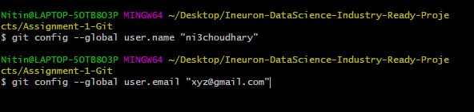

# Git and Github


## Task 1:

### Demonstrate minimum 15 basic docker command with explanation and screenshot.


```
git config –-global user.name "ni3choudhary"
git config --global user.email "xyz@gmail.com"
```
This command sets the author name and email address respectively to be used with your commits.



```
git init 
```
This command is used to start a new repository.


```
git clone
```
This command is used to obtain a repository from an existing URL.


```
git status
```
This command lists all the files that have to be committed.


```
git add main.py
```
This command adds a file to the staging area.


```
git add .
```
This command adds one or more to the staging area.


```
git commit -m 'Added main.py'
```
This command records or snapshots the file permanently in the version history.


```
git commit -a
```
This command commits any files you’ve added with the git add command and also commits any files you've changed since then.


```
git diff
```
This command shows the file differences which are not yet staged.


```
git merge developer
```
This command merge the mentioned branch[developer] into current branch[master].


```
git rm -f index.html
```
This command deletes the file from your working directory and stages the deletion.


```
git log
```
This command is used to list the version history for the current branch.


git branch
```
This command lists all the local branches in the current repository.


```
git branch developer
```
This command creates a new branch.


```
git checkout developer
```
This command used to change the branch.


```


### Assignment 2:

[Hello World Docker Image](https://hub.docker.com/_/hello-world)
Run Hello World Docker Image Locally.


### Assignment 3:
Create a hello world fastapi application.
Create a Dockerfile for your fastapi hello world application.
Build Docker image using Docker file.
Run docker image build in previous step.
Push your Docker image to Docker Hub.


### Assignment 4:
Automate Assignment below task using github action.
1. Build Docker Image 
2. Push Docker Image to Docker hub.