# Git and Github


## Task 1:

### Demonstrate minimum 15 basic Git command with explanation and screenshot.


```
git config –-global user.name "ni3choudhary"
git config --global user.email "xyz@gmail.com"
```
This command sets the author name and email address respectively to be used with your commits.


```
git init 
```
This command is used to start a new repository.
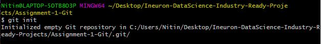


```
git clone
```
This command is used to obtain a repository from an existing URL.
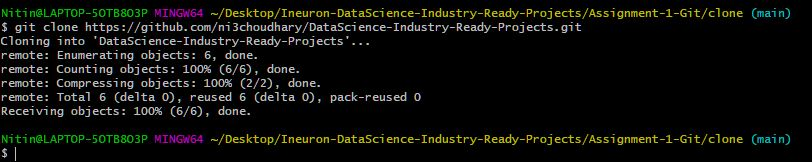


```
git status
```
This command lists all the files that have to be committed.
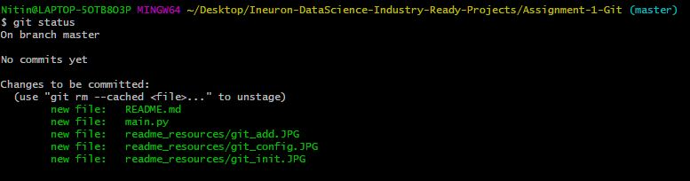

```
git add main.py
```
This command adds a file to the staging area.
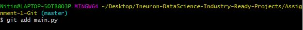


```
git add .
```
This command adds one or more to the staging area.
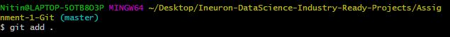


```
git commit -m 'Added main.py'
```
This command records or snapshots the file permanently in the version history.
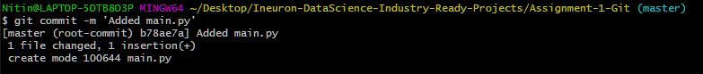


```
git commit -a
```
This command commits any files you’ve added with the git add command and also commits any files you've changed since then.
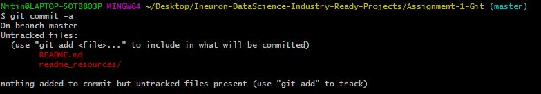


```
git diff
```
This command shows the file differences which are not yet staged.
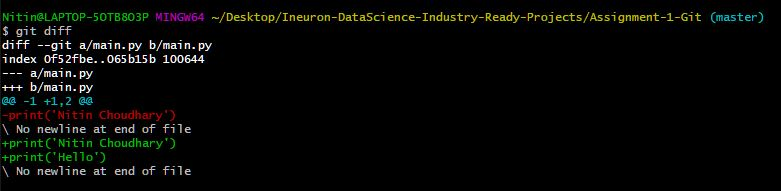


```
git merge developer
```
This command merge the mentioned branch[developer] into current branch[master].
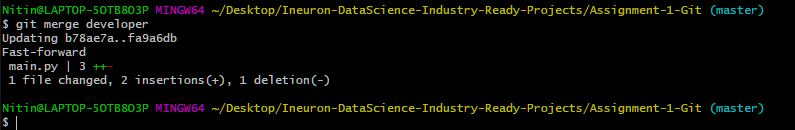


```
git rm -f index.html
```
This command deletes the file from your working directory and stages the deletion.
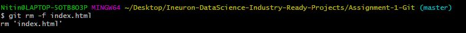


```
git log
```
This command is used to list the version history for the current branch.
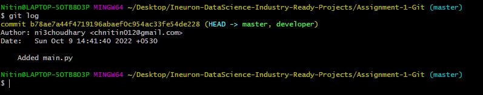

```
git branch
```
This command lists all the local branches in the current repository.
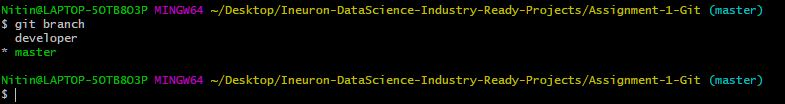


```
git branch developer
```
This command creates a new branch.
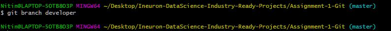


```
git checkout developer
```
This command used to change the branch.
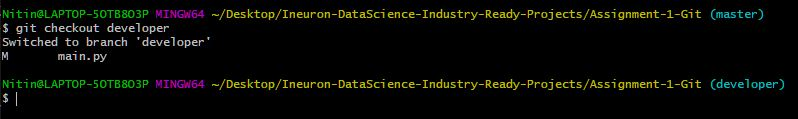


## Task 2:

### Consider that your want to start an open-source project in your organization. Perform all the standard operation to create a repository with minimal permision for all the users. It should contain.

1. Proper open source structure
2. Proper Readme
3. Add 2 collaborator
4. Host GitHub Pages using settings (Designed to host your personal, organization, or project pages from a GitHub repository)

#### 1. Proper Open Source Structure -- 
Please check the files in the repository to run the end to end rain prediction till deployment.

#### 2. Rainfall-Prediction-In-Australia-Deployment (Proper Readme)

[](https://www.kaggle.com/datasets/jsphyg/weather-dataset-rattle-package) 

• This repository consists of files required for end to end implementation of Rain Prediction in Australia ___Machine Learning Web App___ created with ___Flask___ on ___Heroku___ platform.

### Problem statement:
A ML project with EDA and model that helps in predicting next-day rain by training classification models on the target variable RainTomorrow.

### Dataset
You can find the dataset [here.](https://www.kaggle.com/datasets/jsphyg/weather-dataset-rattle-package)

### Dependencies:
* Python 
* Pandas
* Numpy
* Matplotlib
* Seaborn
* Scikit-Learn
* Catboost
* Tensorflow
* Flask 

## setup
To create a project from scratch use following steps - -

- Clone the repository : https://github.com/ni3choudhary/Rainfall-Prediction-In-Australia-Deployment.git
- Inside the project root directory, Create Python Virtual Environment using below command.
```console
$ python3 -m venv venv
``` 

Activate Virtual Environment
```console
$ .venv/bin/activate 
          OR
$ .\venv\Scripts\activate
```
Install Libraries using below command
```console
$ pip install -r requirements.txt
```
- Run jupyter notebook to get the pickle file inside **Model** directory.

- Now run **app.py** on terminal to start local server.
```console
$ python app.py
```

• If you want to view the deployed model, click on the following link: Deployed at: https://rainfall-prediction-australia.herokuapp.com/


#### 3. Add 2 collaborator 

username - **nitin80855**

#### 4. Host GitHub Pages using settings (Designed to host your personal, organization, or project pages from a GitHub repository)

You can find the Github Page <a href='https://nitin80855.github.io/assignement-1-git-task2-github-pages/'>here</a>. 

## Task 3

1. Create a Issue in your github repository.
2. Raise a pull request.
3. Merge A pull request.
4. Reject a pull request with proper comments.
5. Add a Dependabot alerts in your github.(for above cases)
6. Stash changes
7. Create a release your package
8. Setup a Projects Board for your project.


#### 1. Create a Issue in your github repository.

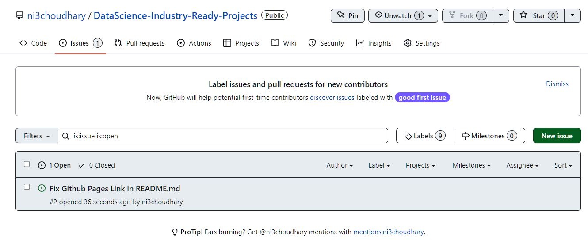

#### 2. Raise a pull request.

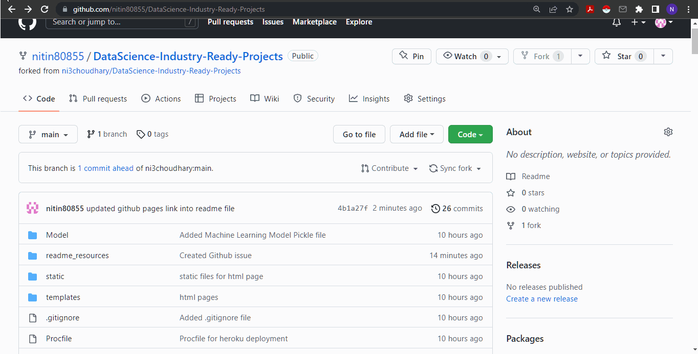

#### 3. Merge A pull request.


#### 4. Reject a pull request with proper comments.
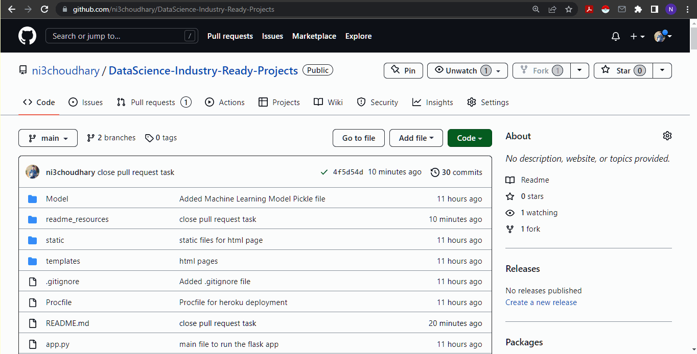

#### 5. Add a Dependabot alerts in your github.(for above cases)
- Dependabot Alerts Added, Please check .github folder for more information.
